# Câblage-entrée-MR

Description de l'installation électrique pour le portail et l'interphone

## Implantation

Alimentation
- c'est la même ligne secteur qui alimente l'interphone et le portail électrique.
- le même disjoncteur 10 ampères protège les deux utilisations

Schémas de câblage général et légende

- rectangles = appareils/bornes/prises
- `Jxx_*` et ovaux = jonctions de câbles
- `NBV`, `TEL`, `MBVN1N2`, `MB` = types de câbles
- entre parenthèse, les libellés ou usages dans les câbles

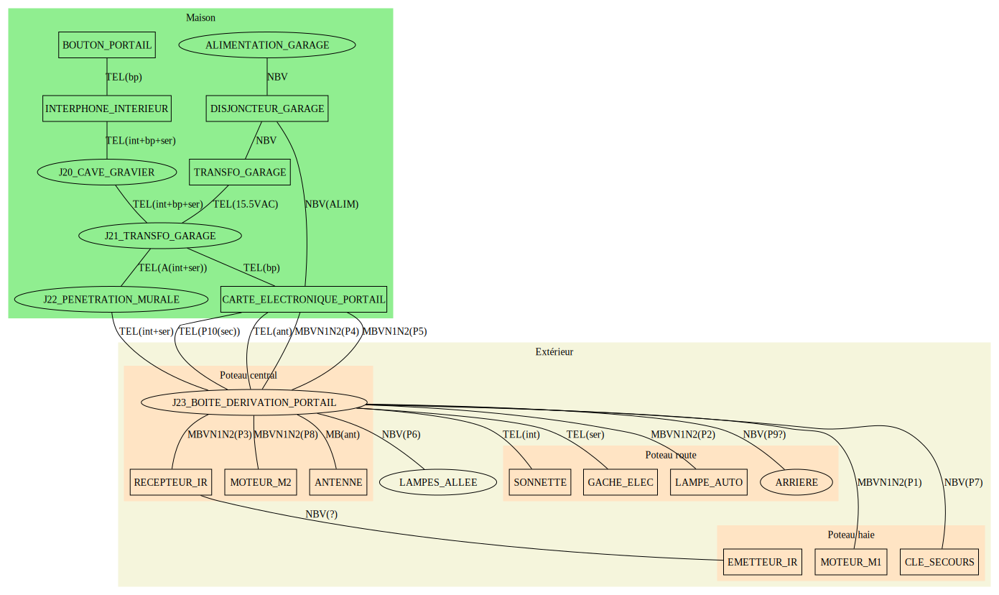

Boite de dérivation *avant rénovation*

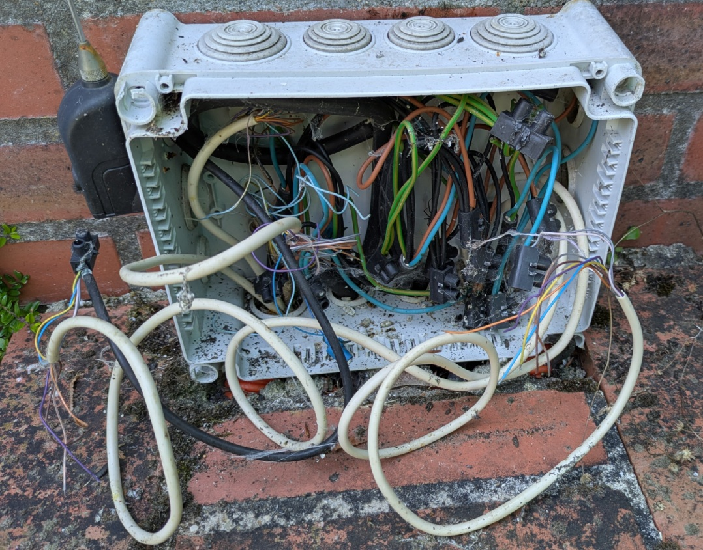

## Portail

**Attention** au non respect des normes de câblage et danger potentiels :

  - *HIGH* : la phase d'alim auto des lampes est envoyée via conducteur vert/jaune `P6_V`
  - *MEDIUM* : il y a "mixité" entre haute tension et basse-tension dans les cables MBVN1N2 `P4` et `P5`
  - *LOW* : les conduteurs `P5_V` et `P3_V` portent du signal BT et ne vont **pas à la TERRE**

Autres informations pertinentes :

- câblage
  - les câbles et conducteurs du côté des IR RX/TX n'ont pas été libellés, faut de longueur d'accès
  - le câble `P6` est extrêmement court et dépasse à peine du sol
  - le boitier de dérivation mesure 24cm sur 19cm sur 10cm et devrait être IP 65 minimum
  - moteurs sans encodeurs (donc que de la HT) pour leur câblage
- moteur M1
  - moteur *avec retard en ouverture* (pillier haie) avec commande U/V
  - à l'ouverture FIXME est alimenté, à la fermeture FIXME est alimenté
  - utilise les conducteurs **noirs** pour raccorder son condensateur
- moteur M2
  - moteur *avec retard de fermeture* (pillier central) avec commande X/Y
  - à l'ouverture FIXME est alimenté, à la fermeture FIXME est alimenté
  - utilise les conducteurs **rouges** pour raccorder son condensateur

FIXME: quel cable travail quand ?

Configuration ZA3

- transformateur et limiteur de couple
  - alimentation : L1T / L2T = 230V AC (= secteur après fusibles)
  - sortie limiteur HT
    - min CT sur 1 = L2T
    - max CT sur 4 = L1T
    - position 3 ~ 200V AC entre CT et L2T
  - sortie commande BT
    - sortie libellée 12V : mesuré 17V AC
    - sortie libellée 24V : mesuré 25.5V AC

- DIP switch
  - DIP8 sur ON (haut)
    - pas de fonction "fermeture en étape d'ouverture" activée (donc `2`-`CX` non raccordé)
  - DIP2 sur OFF (bas) ou bien ON (haut) : voir ci-dessous
    - active le cycle "ouvre-stop-ferme-stop" au lieu de "ouvre-ferme"
    - permet d'immobiliser les vantaux à mi-ouverture (non appuyé) pour démontage/déblocage facilité
  - tous les autres DIP OFF (bas)

- potentiomètres
  - pour réduire la valeur, tourner anti-horaire
  - la tension d'alimentation +/- des potentiomètres est de **5V DC**
  - celui de gauche `TL`
    - réglage temps de fonctionnement ouverture/fermeture : 0 à 120s
    - la tension entre `sortie` et son `-` est mesuré à `1.1V DC` en fonctionnement satisfaisant
  - celui du milieu `TCA` (**a priori inutilisé**)
    - réglage du temps de fermeture automatique : 1 à 120s
    - la tension entre `sortie` et son `-` est mesuré à `0.73V DC` en fonctionnement satisfaisant
  - celui de droite `TR2M`
    - réglage *simultané* retard en fermeture M2 (pillier central) : 0 à 15s
    - réglage *simultané* retard en ouverture M1 (pillier haie) : 0 à 30s
    - la tension entre `sortie` et son `-` est mesuré à `2.18V DC` en fonctionnement satisfaisant
  - 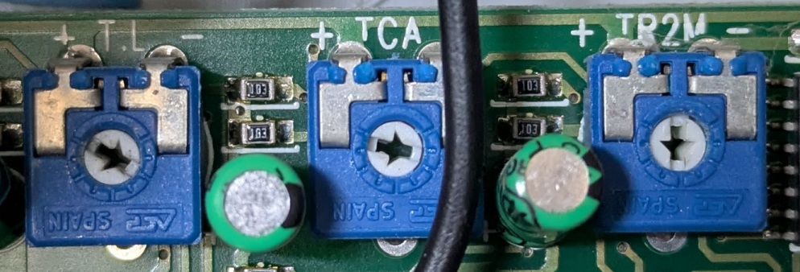

Pilotage du portail

- entre 1 et 2 : stop (attention : normalement clos NC car chaîné sur autres fonctions)
- entre 2 et 3 : ouverture (NO)
- entre 2 et 3P : ouverture (NO) partielle (1 vantail)
- entre 2 et 4 : fermeture (NO)
- entre 2 et 7 : ouverture/fermeture

Feedback du portail

- entre 10 et 5 : lampe BT "témoin portail ouvert" (24VAC max 3W)
- entre W et E : lampe HT "clignotante pendant ouverture et fermeture" (230VAC max 25W)
- entre E et E3 : lampe HT "pendant cycle complet ouverture/fermeture" (230VAC max 60W)

Tensions constatées pour les bornes de contrôle :

- 1 = 0V DC
- 2 = 0V DC (causé par bouton STOP NC non raccordé, simulé par un fil)
- 3 = 0V DC (non raccordé)
- 3P = 4.8V DC (non raccordé)
- 4 = 4.8V DC (non raccordé)
- 5 = 0V DC (non raccordé)
- 7 = 4.8V DC (sans bouton/serrure) et 0V (durant l'appui/serrure)
- C1 = 0V DC (quand le champs libre) et 4.8V (quand le champ est obstrué)
- CX = 4.1V DC (non raccordé)
- B1 = 0V DC (non raccordé)
- B2 = 0V DC (non raccordé)

Configuration infra-rouge

- DIP switch
  - 2 OFF = alim 24V AC (max 20W total cumulé depuis la carte ZA3) --> 25.5 VAC effectif
  - 1 ON = 2 couples (même s'il n'y en a qu'un, comme ça pas besoin de repasser plus tard j'imagine)

Schémas électrique portail

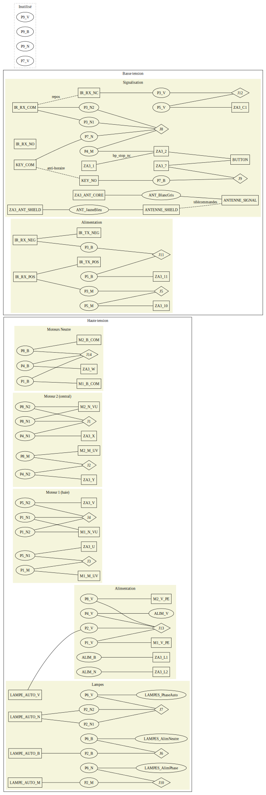

Récepteur IR portail (pillier central) 

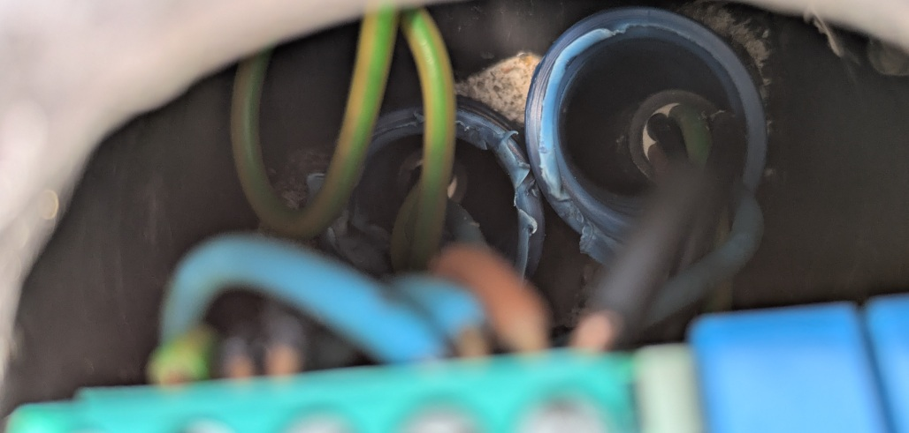

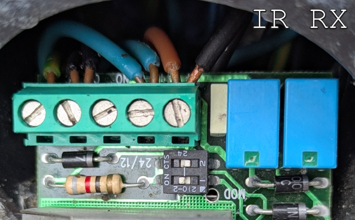

Emetteur IR portail (pillier haie)

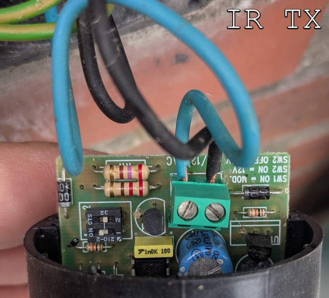

Lampe avec détecteur de présence

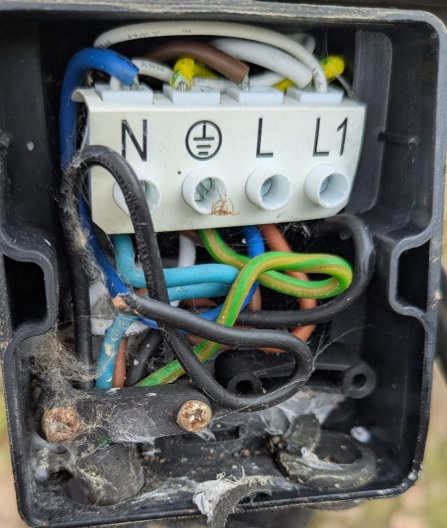

Moteur pillier haie (M1 avec retard d'ouverture)

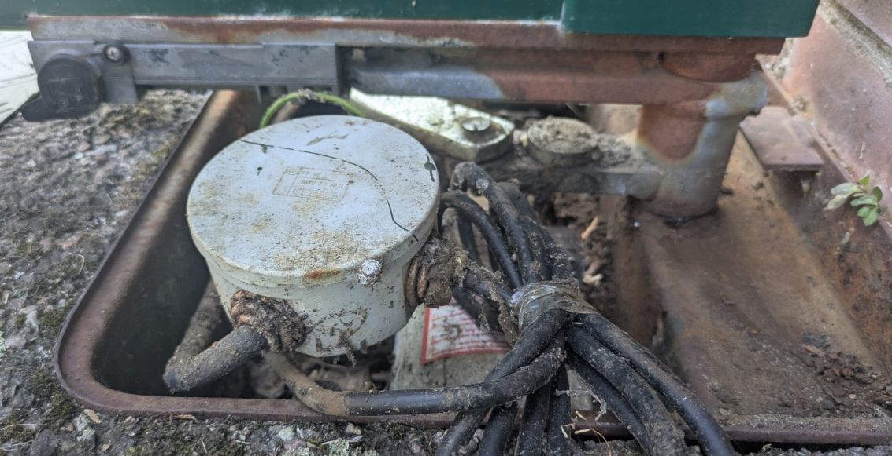

Moteur pillier central (M2 avec retard de fermeture)

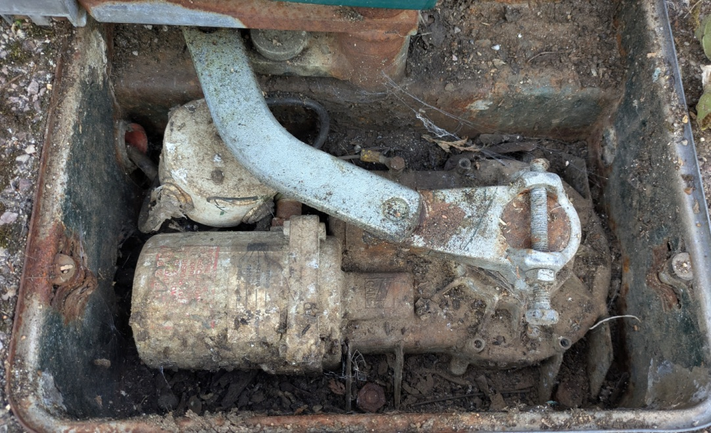

Serrure de commande portail (pillier haie)

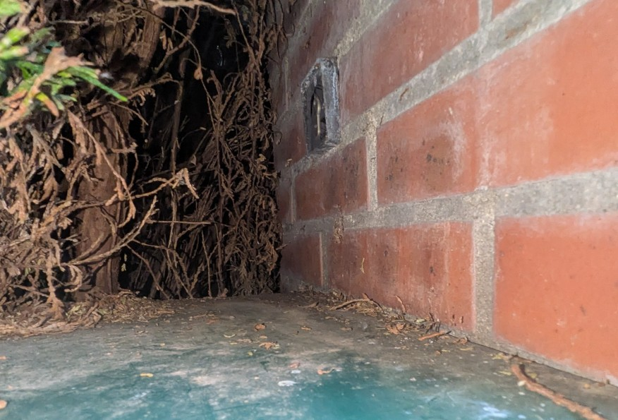

## Interphone/gâche

Cheminement câble intérieur sous-sol 

- longe le garage sur le mur ouest
- passe par la cave gravier sur mur ouest
- remontant au RDC par un trou dans l'armoire de l'entrée

Schémas électrique d'alimentation BT et de commande

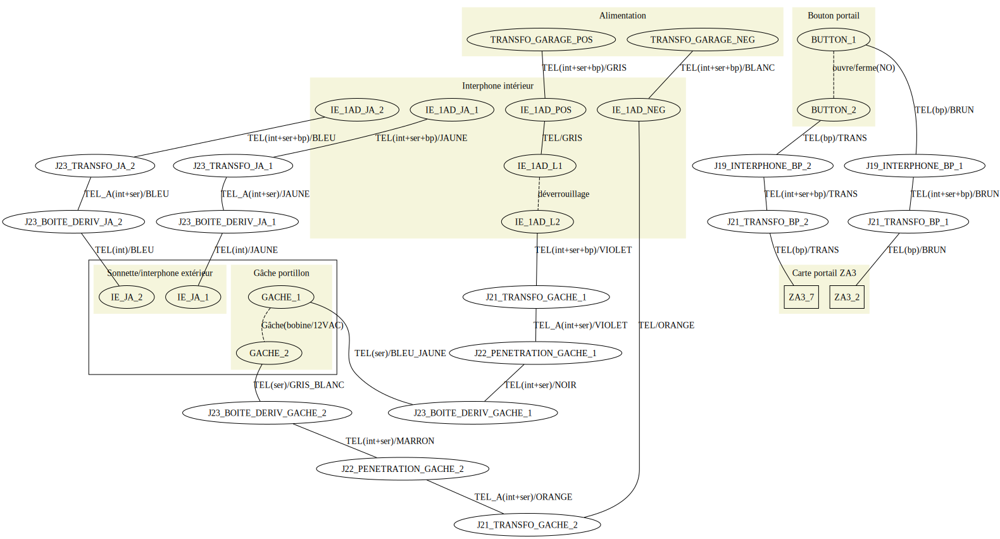

Alimentation sous-sol *avant rénovation*

- par un transformateur HT/BT "12V"
- positionné au garage, coin sud-ouest, au plafond
- utilisé pour interphone/sonnette/gâche
- tension sortie effectivement mesurée : 15.5V AC 

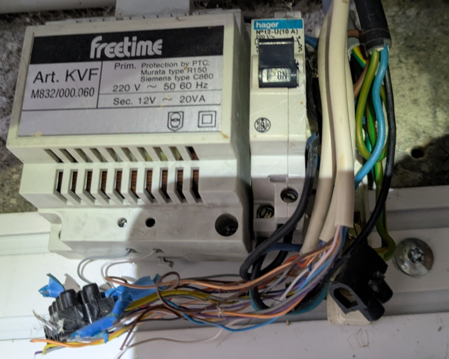

Gâche électrique *avant rénovation*

- basse tension, alimentation "12V"
- 1 temps, pas de mémoire, pas de verrouillage
- Largeur : 21 mm - Hauteur : 69 mm - Profondeur : 29 mm
- IMPORTANT: ouverture vers la gauche quand bornes sur le dessus

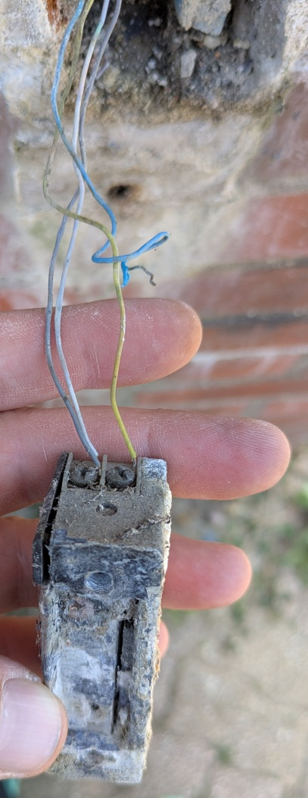

Interphone IE-1AD en alimentation BT AC *avant rénovation*

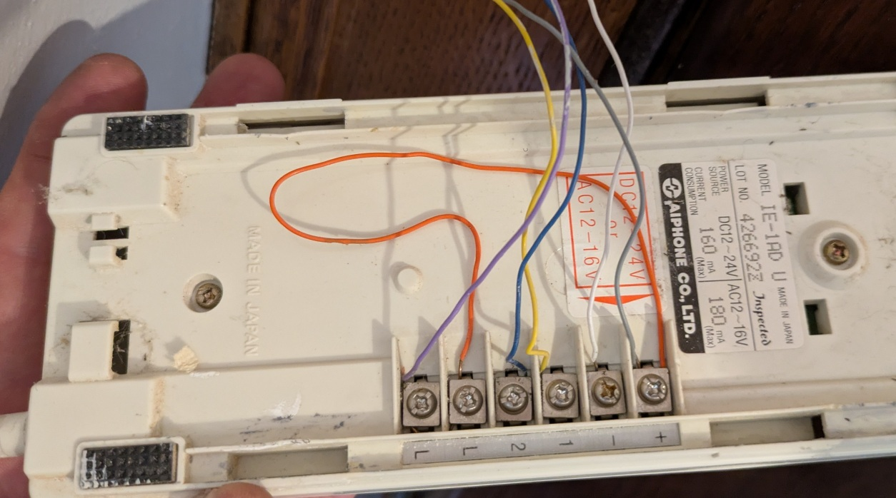

Sonnette/interphone IE-JA

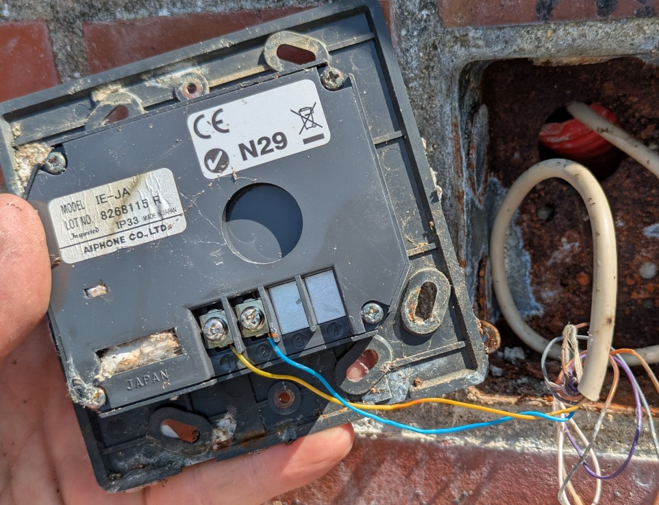
